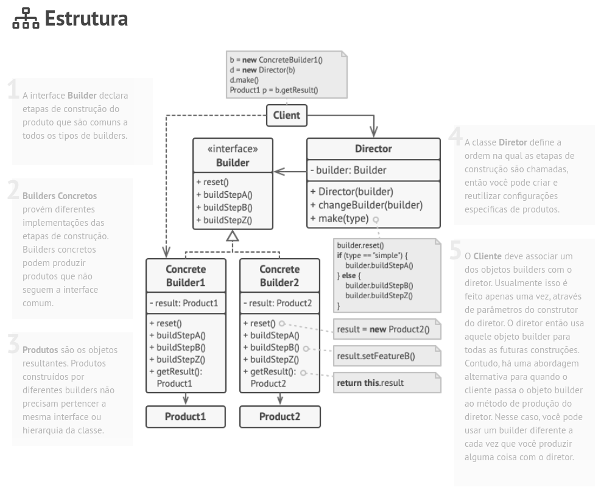

<h1 align="center">Builder</h1>

O Builder é um padrão de projeto criacional que permite a você construir objetos complexos passo a passo. O padrão permite que você produza diferentes tipos e representações de um objeto usando o mesmo código de construção.

O padrão Builder permite que você construa objetos passo a passo, usando apenas aquelas etapas que você realmente precisa. Após implementar o padrão, você não vai mais precisar amontoar dúzias de parâmetros em seus construtores.

### Estrutura

### Aplicabilidade

🚧 Use o padrão Builder para se livrar de um “construtor telescópico”.

🚧 Use o padrão Builder quando você quer que seu código seja capaz de criar diferentes representações do mesmo produto (por exemplo, casas de pedra e madeira).

### Prós e contras

#### ✅ Prós

- Você pode construir objetos passo a passo, adiar as etapas de construção ou rodar etapas recursivamente.
- Você pode reutilizar o mesmo código de construção quando construindo várias representações de produtos.
- Princípio de responsabilidade única. Você pode isolar um código de construção complexo da lógica de negócio do produto.

### ❌ Contras

- A complexidade geral do código aumenta uma vez que o padrão exige criar múltiplas classes novas.

> Fonte: https://refactoring.guru/pt-br/design-patterns/decorator
