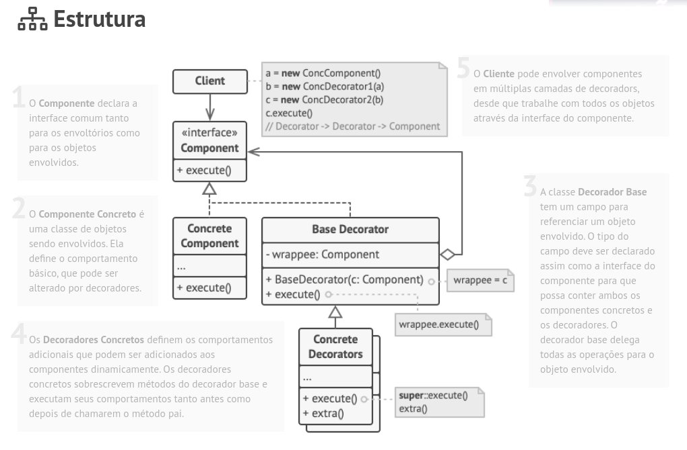

<h1 align="center">Decorator</h1>

O Decorator é um padrão de projeto estrutural que permite que você acople novos comportamentos para objetos ao colocá-los dentro de invólucros de objetos que contém os comportamentos.

### Estrutura

### Aplicabilidade

🚧 Utilize o padrão Decorator quando você precisa ser capaz de projetar comportamentos adicionais para objetos em tempo de execução sem quebrar o código que usa esses objetos.

🚧 Utilize o padrão quando é complicado ou impossível estender o comportamento de um objeto usando herança.

### Prós e contras

#### ✅ Prós

- Você pode estender o comportamento de um objeto sem fazer um nova subclasse.
- Você pode adicionar ou remover responsabilidades de um objeto no momento da execução.
- Você pode combinar diversos comportamentos ao envolver o objeto com múltiplos decoradores.
- Princípio de responsabilidade única. Você pode dividir uma classe monolítica que implementa muitas possíveis variantes de um comportamento em diversas classes menores

### ❌ Contras

- É difícil remover um invólucro de uma pilha de invólucros.
- É difícil implementar um decorador de tal maneira que seu comportamento não dependa da ordem do pilha de decoradores.
- A configuração inicial do código de camadas pode ficar bastante feia.
> Fonte: https://refactoring.guru/pt-br/design-patterns/decorator
